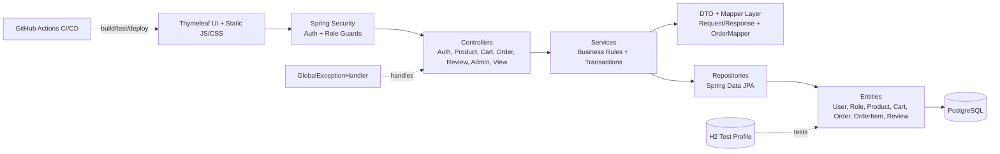
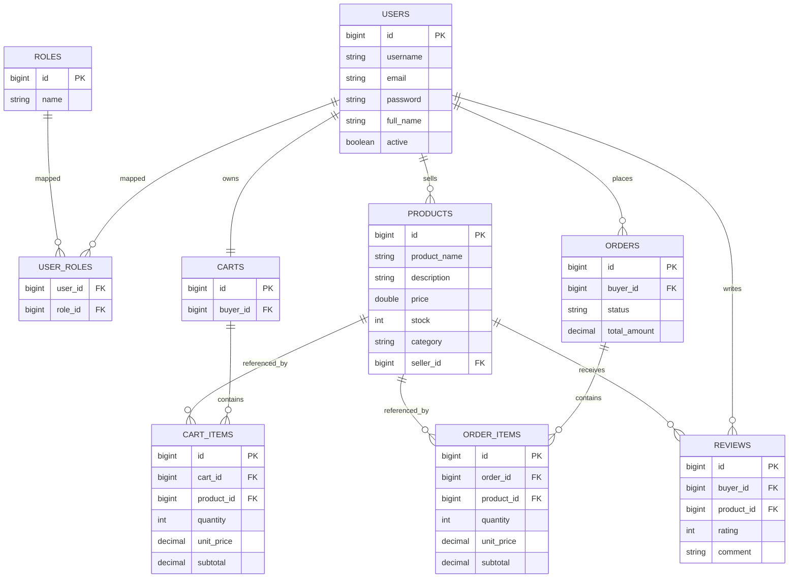

# Mini Marketplace

Small but complete Software Engineering Lab project that follows the Full Stack Web Application with DevOps Pipeline rubric.

## Objective

Build and demonstrate a professional workflow using Spring Boot, Thymeleaf, PostgreSQL, Spring Security role-based access, Docker, GitHub Actions CI/CD, and Render deployment.

## Team

- Sumaiya Akter
- Khadimul Islam Mahi

## Theme and Roles

- Theme: Mini Marketplace
- Roles: ADMIN, SELLER, BUYER

## Tech Stack

- Backend: Spring Boot, Java 21, Maven
- Frontend: Thymeleaf templates, reusable CSS/JS assets
- Database: PostgreSQL (runtime), H2 (tests)
- Security: Spring Security + BCrypt + role-based access control
- Testing: JUnit 5, Mockito, SpringBootTest, MockMvc, Spring Security Test
- DevOps: Docker, Docker Compose, GitHub Actions, Render

## Architecture

Layered structure:

- Controller layer
- Service layer
- Repository layer
- Entity and DTO layer
- Security layer
- Exception handling layer
- Thymeleaf view layer

Key package root: `src/main/java/com/marketplace`

### Architecture Diagram (Mermaid)



## Functional Scope

- Authentication: register, login, logout, me
- Seller: create, update, delete products
- Buyer: browse products, manage cart, place orders, view order history
- Admin: user management operations
- Role-restricted API endpoints and role-aware Thymeleaf dashboards

## Thymeleaf Views

View routes are mapped by MVC controller and rendered from templates:

- `/dashboard`
- `/login`
- `/register`
- `/products/view`
- `/products/view/{id}`
- `/cart/view`
- `/orders/view`
- `/seller/dashboard`
- `/admin/dashboard`

Templates are in `src/main/resources/templates`, with shared header/footer fragments in `src/main/resources/templates/fragments/layout.html`.

## API Summary

Base path: `/api`

- Auth: `POST /auth/register`, `POST /auth/login`, `POST /auth/logout`, `GET /auth/me`
- Products: `GET /products`, `GET /products/{id}`, `POST /products`, `PUT /products/{id}`, `DELETE /products/{id}`
- Cart: `GET /cart/me`, `POST /cart/me/items`, `PUT /cart/me/items/{cartItemId}`, `DELETE /cart/me/items/{cartItemId}`, `DELETE /cart/me/items`
- Orders: `POST /orders`, `GET /orders/me`
- Reviews: `/products/{productId}/reviews/**`
- Admin: `GET /admin/users`, `GET /admin/users/{id}`, `PUT /admin/users/{id}/role`, `PUT /admin/users/{id}/deactivate`

Detailed reference: `docs/api-endpoints.md`

## Database

Runtime DB: PostgreSQL

Core tables include:

- users
- roles
- user_roles
- products
- carts
- cart_items
- orders
- order_items
- reviews

Entity relationships include 1:M, M:1, and M:M (for example user_roles).

### ER Diagram (Mermaid)



## Testing

Test strategy:

- Unit tests: service and security logic
- Integration tests: controller/API and Thymeleaf view routes
- SQL-seeded integration setup under `src/test/resources/sql`

Latest full verify evidence:

- Unit tests: 46 passed, 0 failed
- Integration tests: 35 passed, 0 failed
- Total: 81 passed, 0 failed

Run locally:

```bash
mvn clean verify -Dmaven.javadoc.skip=true
```

## Docker

- docs/test-report.md

Auto-deploy repeatability proof #2: test commit for CI/CD validation.

## Local Development Setup

### 1) Clone

```bash
git clone https://github.com/sa-hcc5142/sa-hcc5142-swlab_mini_marketplace_project.git
cd sa-hcc5142-swlab_mini_marketplace_project
```

### 2) Environment Variables

Create local environment variables or use .env values for Docker:

- DB_URL
- DB_USERNAME
- DB_PASSWORD
- SERVER_PORT

### 3) Run with Maven

```bash
mvn spring-boot:run
```

### 4) Run with Docker Compose

```bash
docker compose up --build
```

Configuration safety:

- No hardcoded DB secrets in compose file
- Environment-variable driven DB user/password/name
- Spring datasource configuration uses environment variables

## CI/CD

- CI workflow: `.github/workflows/ci.yml`
	- Triggered on push and PR to main (also includes develop)
	- Runs `mvn clean verify`
- CD workflow: `.github/workflows/cd-render.yml`
	- Triggered on push to main
	- Deploys to Render and checks health endpoint

## Deployment

- Platform: Render
- Live URL: https://mini-marketplace-prod.onrender.com/
- Repository: https://github.com/sa-hcc5142/sa-hcc5142-swlab_mini_marketplace_project

## Required Deliverable Files

- API endpoints: `docs/api-endpoints.md`
- CI/CD explanation: `docs/ci-cd.md`
- Test report: `docs/test-report.md`
- Demo script: `docs/demo-script.md`
- Docker guide: `docs/docker-setup.md`
